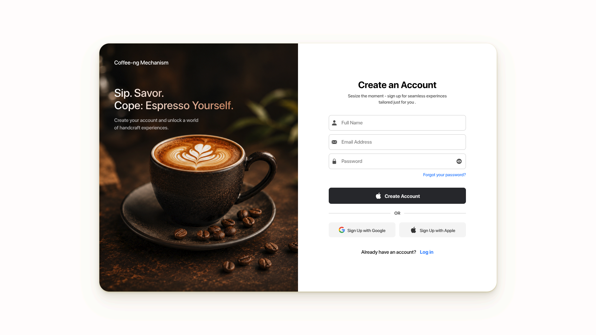

Welcome to my Daily UI Challenge repository! Here, you'll find a collection of my daily design outputs as part of the challenge. Explore my Daily UI Challenge journey, where I create simple and engaging user interfaces based on prompts I receive in my daily emails. Each design showcases my daily practice and creativity. Check out the collection and feel free to share your thoughts!

## Day 1: Sign Up

Prompt: Create a sign up page, modal, form, or app screen related to signing up for something. It could be for a volunteer event, contest registration, a giveaway, or anything you can image.

Output Image:

